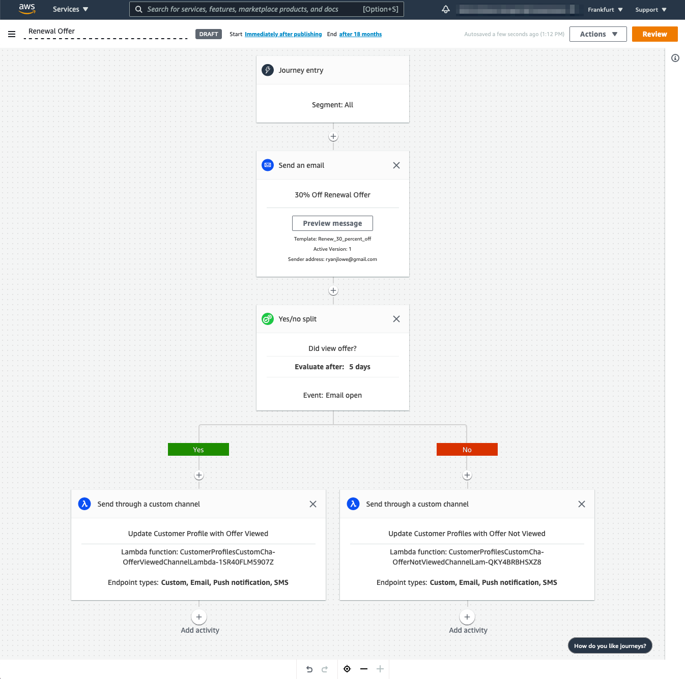

# Amazon Pinpoint for Amazon Connect Delivery Toolkit

This repository serves as a guide for system integrators who have experience working with Amazon Connect and are looking for ways to expand their set of opportunities by introducing Amazon Pinpoint to the Amazon Connect environment.  Below are a set of use-cases that showcase different integration points between Amazon Connect and Amazon Pinpoint and the value that Amazon Pinpoint brings.

## Table of Contents

* [What is Amazon Pinpoint](#What-is-Amazon-Pinpoint)
* [Use-Case: Call Deflection](#Use-Case-Call-Deflection)
  * [Solution: Amazon Pinpoint SMS Chat Bot](#solution-amazon-pinpoint-sms-chat-bot)
  * [Solution: Amazon Pinpoint SMS Connect Chat Connector](#solution-amazon-pinpoint-sms-connect-chat-connector)
* [Use-Case: Send Campaign Notifications](#Use-Case-Send-Campaign-Notifications)
  * [Solution: Amazon Pinpoint custom channel for Amazon Connect](#Solution-Amazon-Pinpoint-custom-channel-for-Amazon-Connect)
* [Use-Case: Transactional Outbound Communications - Email, SMS, etc](#Use-Case-Transactional-Outbound-Communications---Email-SMS-etc)
  * [Solution: Using Amazon Pinpoint to send text messages in Amazon Connect](#Solution-Using-Amazon-Pinpoint-to-send-text-messages-in-Amazon-Connect)
* [Use-Case: Omni-Channel Customer Segmentation / Insights](#Use-Case-Omni-Channel-Customer-Segmentation--Insights)
* [Use-Case: Augment Customer Profiles with Marketing Data](#Use-Case-Augment-Customer-Profiles-with-Marketing-Data)
  * [Solution: Amazon Pinpoint Connect Profiles Customer Channel](#Solution-Amazon-Pinpoint-Connect-Profiles-Customer-Channel)
* [Use-Case: Agent Chat over SMS](#Use-Case-Agent-Chat-over-SMS)
  * [Solution: Amazon Pinpoint Two-Way SMS Connect Chat Connector](#solution-amazon-pinpoint-two-way-sms-connect-chat-connector)
* [Other Amazon Pinpoint Resources](#Other-Amazon-Pinpoint-Resources)

## What is Amazon Pinpoint
Amazon Pinpoint is a multi-channel digital engagement service. It is a part of the Customer Engagement suite of services, enabling customers to send both promotional and transactional messages across email, SMS, push notification, voice, and custom channels.  For more details, and a quick guide to Pinpoint terms, see [Amazon Pinpoint Key Concepts](pinpoint_detail/README.md).

See the [Other Amazon Pinpoint Resources](#Other-Amazon-Pinpoint-Resources) below for official documentation, reference architectures with full CloudFormation source code, fully-vetted AWS Solutions, and recorded webinars and other videos.

## Use-Case: Call Deflection

Call deflection can be an extremely valuable tool for AWS customers to reduce their overall call center costs.  With call deflection, we look to resolve end-customer requests via a different channel.  Amazon Connect introduced chat as a mode for end-customers to get assistance from a live agent without needing to call into the call center.  

Using Amazon Pinpoint for SMS introduces a few different ways that we can offer more call deflection options.  Amazon Pinpoint has [two-way SMS functionality](https://docs.aws.amazon.com/pinpoint/latest/userguide/channels-sms-two-way.html) that can be enabled so that Amazon Pinpoint can be used to send outgoing SMS text messages and process incoming SMS responses from end-customers.  In this way, customers can build synchronous or asynchronous conversational mechanisms on-top of Amazon Pinpoint's two-way SMS.

### Solution: [Amazon Pinpoint SMS Chat Bot](https://aws.amazon.com/blogs/messaging-and-targeting/create-an-sms-chatbox-with-amazon-pinpoint-and-lex/)

[Amazon Lex](https://aws.amazon.com/lex/) is an AI service for building conversation interfaces into any application using voice or text. Amazon Lex has already demonstrated its ability to perform standard tasks like Appointment reminders, confirmations, and automatic rescheduling.  Call centers that integrate Amazon Lex into their call flows to help automate calls have shown to have direct cost savings.

[Amazon Lex can be integrated into Amazon Pinpoint to create a two-way SMS chat bot](https://aws.amazon.com/blogs/messaging-and-targeting/create-an-sms-chatbox-with-amazon-pinpoint-and-lex/) that can be used to deliver Amazon Lex's capabilities over the SMS channel.

This solution can be extended to include a [seamless handoff to Amazon Connect](https://aws.amazon.com/blogs/messaging-and-targeting/creating-a-seamless-handoff-between-amazon-pinpoint-and-amazon-connect/) to allow for scenarios that Amazon Lex cannot be coded to handle.

### Solution: [Amazon Pinpoint SMS Connect Chat Connector](https://github.com/Ryanjlowe/amazon-pinpoint-sms-connect-chat)

Amazon Connect's chat experience can be extended to enable using Amazon Pinpoint's two-way SMS as a delivery mechanism.  In this way, call center agents are able to field questions from the website's chat interface and chat messages sent via SMS.  Further, this mechanism could be deployed initiated directly from an inbound call flow allowing the call to be deflected to an agent that can handle multiple chat sessions simultaneously.

The [Amazon Pinpoint SMS Connect Chat Connector](https://github.com/Ryanjlowe/amazon-pinpoint-sms-connect-chat) is a POC showcasing these capabilities.  Customers can follow the pattern and implement their own SMS to chat flows very quickly.

## Use-Case: Send Campaign Notifications

Amazon Pinpoint has three channels available natively out of the box that work with campaigns and journeys: Email, SMS, and Push for Mobile Devices.  Additionally, customers can create their own [custom channels](https://docs.aws.amazon.com/pinpoint/latest/developerguide/channels-custom.html) allowing marketers to send messages across any "channel" using any service that can be reached by an AWS Lambda function.  

### Solution: Amazon Pinpoint custom channel for Amazon Connect

The Amazon Pinpoint team has [created and open-sourced an Amazon Connect custom channel](https://github.com/aws-samples/amazon-pinpoint-connect-channel).  This channel can be dropped into a campaign or journey to trigger and outbound call via Amazon Connect. As this [blog points out, this can be used to send voice appointment reminders](#https://aws.amazon.com/blogs/messaging-and-targeting/send-voice-appointment-reminders-using-amazon-pinpoint-custom-channels-and-amazon-connect/) allowing an interactive experience where end-customers could press a button to speak to an agent if needed.  Marketers can use Amazon Pinpoint's segmentation and targeting capabilities to target end-customers to receive an outbound call just like they would for email or SMS as a channel.

## Use-Case: Transactional Outbound Communications - Email, SMS, etc

At its core, Amazon Pinpoint is a message delivery service.  ISVs can use Amazon Pinpoint to deliver messages to end-users across email, SMS, push, and voice channels. Amazon Pinpoint uses Amazon Simple Email Service to deliver email messages.  Amazon Pinpoint can send SMS messages in [over 200 countries and regions](https://docs.aws.amazon.com/pinpoint/latest/userguide/channels-sms-countries.html). Amazon Pinpoint supports push messages using Firebase Cloud Messaging, Apple Push Notification service, Baidu Cloud Push, and Amazon Device Message.

Using Amazon Connect's ability to [invoke an AWS Lambda function in a contact flow](https://docs.aws.amazon.com/connect/latest/adminguide/connect-lambda-functions.html), customers can make use of Amazon Pinpoint's [Send Messages API](https://docs.aws.amazon.com/goto/WebAPI/pinpoint-2016-12-01/SendMessages) to deliver messages over SMS (or email, push, or other channel).

### Solution: [Using Amazon Pinpoint to send text messages in Amazon Connect](https://aws.amazon.com/blogs/contact-center/using-amazon-pinpoint-to-send-text-messages-in-amazon-connect/)

Calling Amazon Pinpoint's transactional API can be used for many different use-cases.  An SMS message confirmation message could be sent during a call-back scenario.  The recipient's phone number could be verified by sending a one time password.  Or the agent could trigger an SMS or email message that has details of the conversation, such as references and links.  This [blog post solution](https://aws.amazon.com/blogs/contact-center/using-amazon-pinpoint-to-send-text-messages-in-amazon-connect/) outlines the very simple steps needed to connect Amazon Pinpoint in a contact flow.

## Use-Case: Omni-Channel Customer Segmentation / Insights

COMING SOON

## Use-Case: Augment Customer Profiles with Marketing Data

[Amazon Connect's Customer Profiles](https://aws.amazon.com/connect/customer-profiles/) allow customers to deliver more personalized customer experiences with less effort through a unified view of all customer data presented to the agent at the moment of contact.

The [Customer Profile APIs](https://docs.aws.amazon.com/customerprofiles/latest/APIReference/Welcome.html) allow for custom integrations to be built so that any application can write data and update profile data.  Data from Amazon Pinpoint could enrich the customer profile in many different ways.  This includes watching for email hard bounces to note that the customer's email address is invalid.  Customer Profiles could be updated to show how engaged a customer is with the various communications. Or it could track what offers, journey paths, or other treatments customers receive during marketing campaigns to ensure future communications are consistent.

### Solution: [Amazon Pinpoint Connect Profiles Customer Channel](https://github.com/Ryanjlowe/amazon-pinpoint-connect-profiles-channel)

This solution deploys a custom channel that is configured to update Profile attributes.  In the deployed example, a marketer could place the custom channel after a Yes/No split checking if an email was opened.  The example is an email is sent that offers a 30% off discount to renew a subscription.  After a given time window, it is written back to the end customer's Profile the offer they were assigned and whether it was opened or not.  This could be used by an agent during a renewal or churn scenario to ensure the end customer knows the offer is available in case they didn't open the email.

This is just one example, and custom channels could be built for a variety of scenarios where Profile attributes can be updated.

## Use-Case: Agent Chat over SMS

This repository already discuses how connecting Amazon Pinpoint's two-way SMS to Amazon Connect's chat can be used for [call deflection](#Use-Case-Call-Deflection), but this technique can be used on its own as well.  Offering end-customers the ability to get customer service by calling the call center, chatting via the website, or chatting over SMS provides customers many different channels of support without introducing more places that an agent has to log into.

### Solution: [Amazon Pinpoint Two-Way SMS Connect Chat Connector](https://github.com/Ryanjlowe/amazon-pinpoint-sms-connect-chat)

Amazon Connect's chat experience can be extended to enable using Amazon Pinpoint's two-way SMS as a delivery mechanism.  In this way, call center agents are able to field questions from the website's chat interface and chat messages sent via SMS.  Further, this mechanism could be deployed initiated directly from an inbound call flow allowing the call to be deflected to an agent that can handle multiple chat sessions simultaneously.

The [Amazon Pinpoint SMS Connect Chat Connector](https://github.com/Ryanjlowe/amazon-pinpoint-sms-connect-chat) is a POC showcasing these capabilities.  Customers can follow the pattern and implement their own SMS to chat flows very quickly.

## Other Amazon Pinpoint Resources
* [Amazon Pinpoint Home](https://aws.amazon.com/pinpoint/)
* [AWS Digital User Engagement Videos and Recorded Webinars](https://awsdue.tv/)
* [Digital User Engagement Reference Architectures](https://github.com/aws-samples/digital-user-engagement-reference-architectures)
* [AWS Solutions](https://aws.amazon.com/solutions/implementations/?solutions-all.sort-by=item.additionalFields.sortDate&solutions-all.sort-order=desc&solutions-all.q=pinpoint&solutions-all.q_operator=AND)
* [Amazon Pinpoint Documentation](https://docs.aws.amazon.com/pinpoint/)
